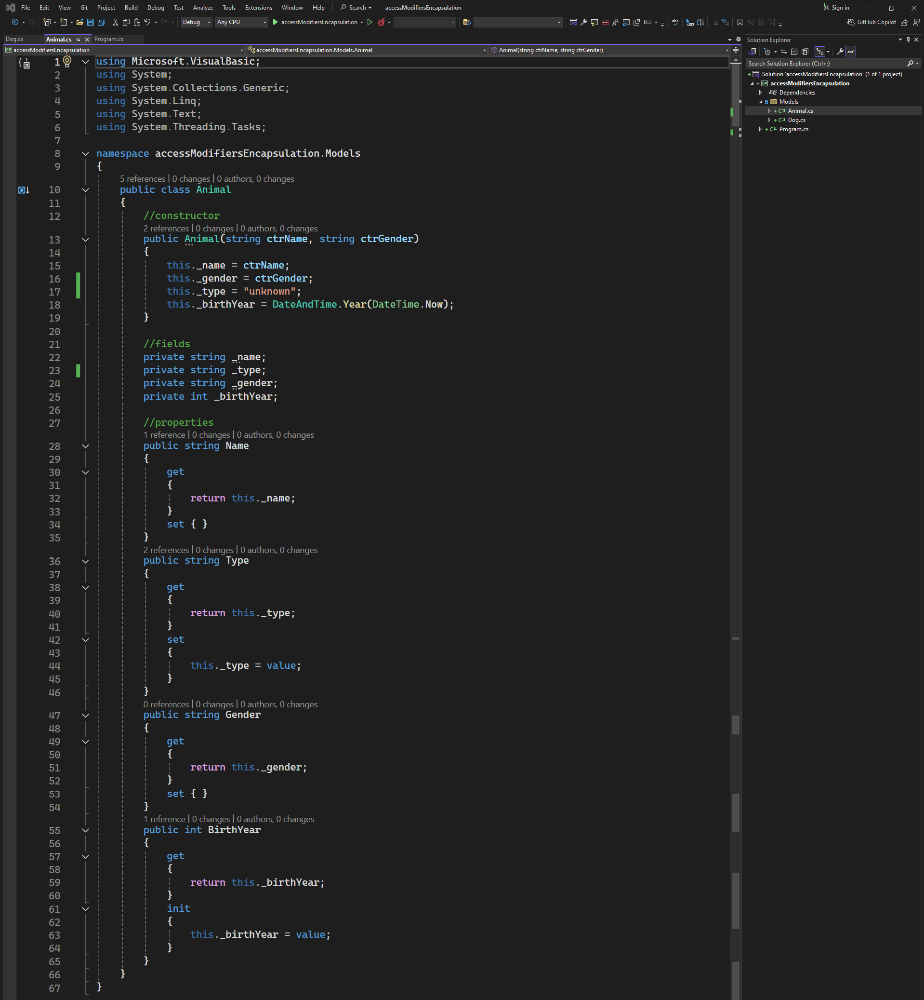
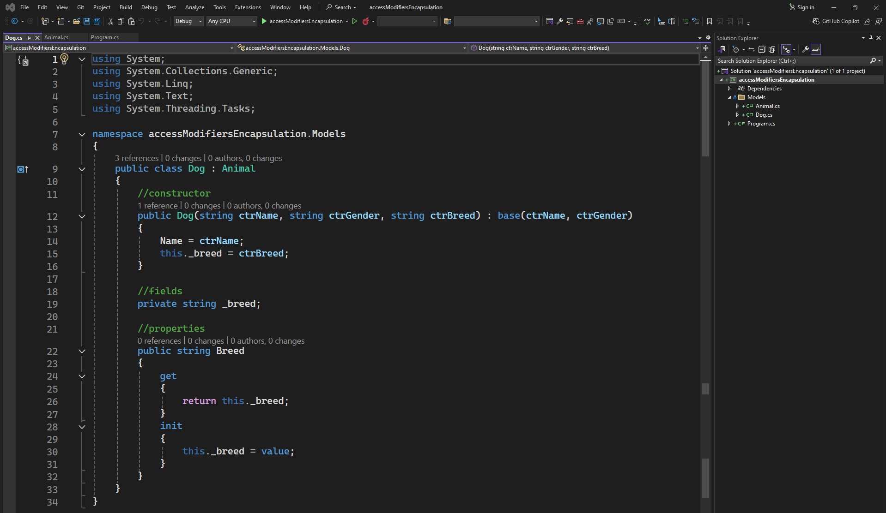

# Access Modifiers Encapsulation

### Animal class code:
```csharp
using Microsoft.VisualBasic;
using System;
using System.Collections.Generic;
using System.Linq;
using System.Text;
using System.Threading.Tasks;

namespace accessModifiersEncapsulation.Models
{
    public class Animal
    {
        //constructor
        public Animal(string ctrName, string ctrGender)
        {
            this._name = ctrName;
            this._gender = ctrGender;
            this._type = "unknown";
            this._birthYear = DateAndTime.Year(DateTime.Now);
        }

        //fields
        private string _name;
        private string _type;
        private string _gender;
        private int _birthYear;

        //properties
        public string Name
        {
            get
            {
                return this._name;
            }
            set { }
        }
        public string Type
        {
            get
            {
                return this._type;
            }
            set
            {
                this._type = value;
            }
        }
        public string Gender
        {
            get
            {
                return this._gender;
            }
            set { }
        }
        public int BirthYear
        {
            get
            {
                return this._birthYear;
            }
            init
            {
                this._birthYear = value;
            }
        }
    }
}
```
### Animal class image: 

--- ---
### Dog class code:
```csharp
using System;
using System.Collections.Generic;
using System.Linq;
using System.Text;
using System.Threading.Tasks;

namespace accessModifiersEncapsulation.Models
{
    public class Dog : Animal
    {
        //constructor
        public Dog(string ctrName, string ctrGender, string ctrBreed) : base(ctrName, ctrGender)
        {
            Name = ctrName;
            this._breed = ctrBreed;
        }

        //fields
        private string _breed;

        //properties
        public string Breed
        {
            get
            {
                return this._breed;
            }
            init
            {
                this._breed = value;
            }
        }
    }
}
```
### Dog class image:
