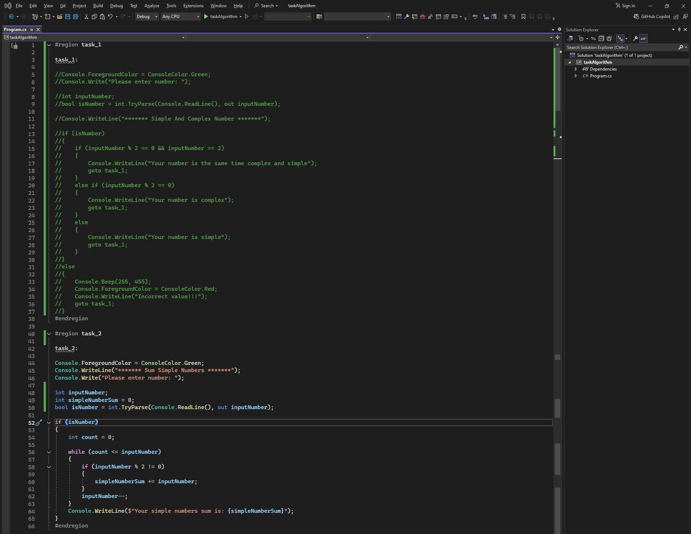

# Algorithm Tasks

### Task code:
```csharp
#region task_1

task_1:

//Console.ForegroundColor = ConsoleColor.Green;
//Console.Write("Please enter number: ");

//int inputNumber;
//bool isNumber = int.TryParse(Console.ReadLine(), out inputNumber);

//Console.WriteLine("******* Simple And Complex Number *******");

//if (isNumber)
//{
//    if (inputNumber % 2 == 0 && inputNumber == 2)
//    {
//        Console.WriteLine("Your number is the same time complex and simple");
//        goto task_1;
//    }
//    else if (inputNumber % 2 == 0)
//    {
//        Console.WriteLine("Your number is complex");
//        goto task_1;
//    }
//    else
//    {
//        Console.WriteLine("Your number is simple");
//        goto task_1;
//    }
//}
//else
//{
//    Console.Beep(255, 455);
//    Console.ForegroundColor = ConsoleColor.Red;
//    Console.WriteLine("Incorrect value!!!");
//    goto task_1;
//}
#endregion

#region task_2

task_2:

Console.ForegroundColor = ConsoleColor.Green;
Console.WriteLine("******* Sum Simple Numbers *******");
Console.Write("Please enter number: ");

int inputNumber;
int simpleNumberSum = 0;
bool isNumber = int.TryParse(Console.ReadLine(), out inputNumber);

if (isNumber)
{
    int count = 0;

    while (count <= inputNumber)
    {
        if (inputNumber % 2 != 0)
        {
            simpleNumberSum += inputNumber;
        }
        inputNumber--;
    }
    Console.WriteLine($"Your simple numbers sum is: {simpleNumberSum}");
}
#endregion
```
### Task image:
