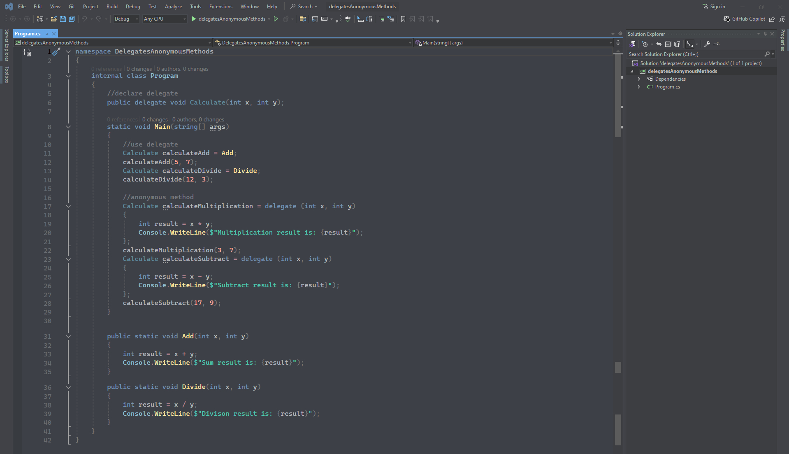
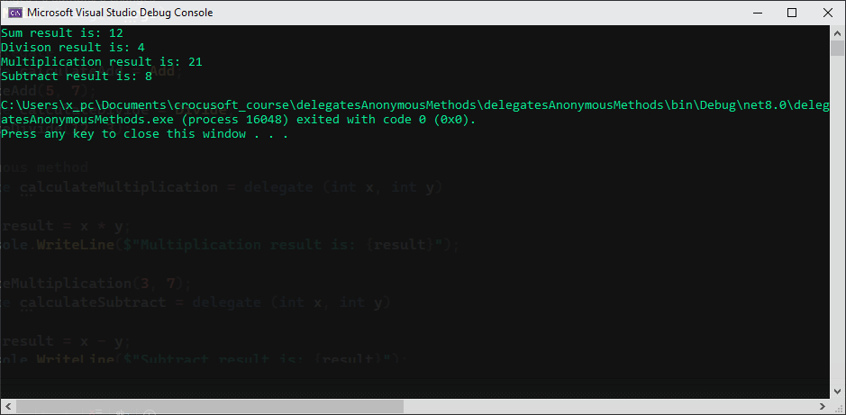

# Delegates & Anonymous Methods

### Program code:
```csharp
namespace DelegatesAnonymousMethods
{
    internal class Program
    {
        //declare delegate
        public delegate void Calculate(int x, int y);

        static void Main(string[] args)
        {
            //use delegate
            Calculate calculateAdd = Add;
            calculateAdd(5, 7);
            Calculate calculateDivide = Divide;
            calculateDivide(12, 3);

            //anonymous method
            Calculate calculateMultiplication = delegate (int x, int y)
            {
                int result = x * y;
                Console.WriteLine($"Multiplication result is: {result}");
            };
            calculateMultiplication(3, 7);
            Calculate calculateSubtract = delegate (int x, int y)
            {
                int result = x - y;
                Console.WriteLine($"Subtract result is: {result}");
            };
            calculateSubtract(17, 9);
        }

        public static void Add(int x, int y)
        {
            int result = x + y;
            Console.WriteLine($"Sum result is: {result}");
        }
        public static void Divide(int x, int y)
        {
            int result = x / y;
            Console.WriteLine($"Divison result is: {result}");
        }
    }
}
```
### Program image:

---
### Output image:
