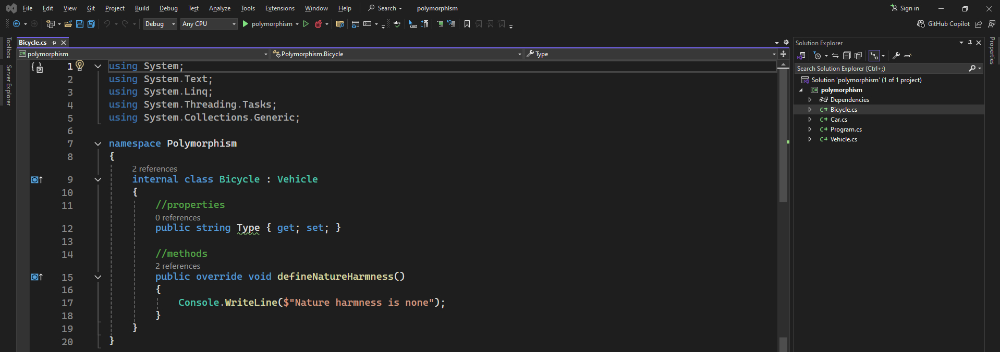
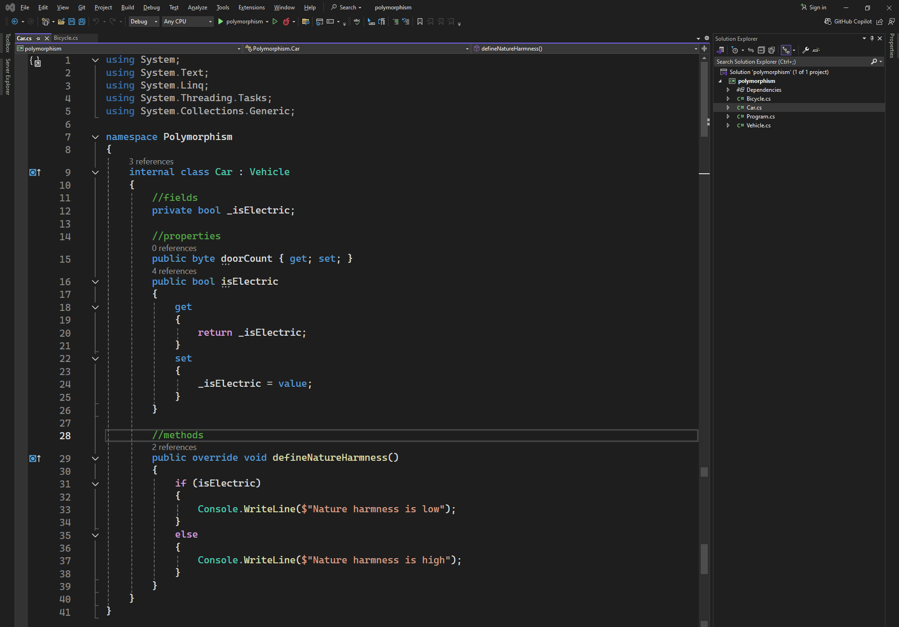
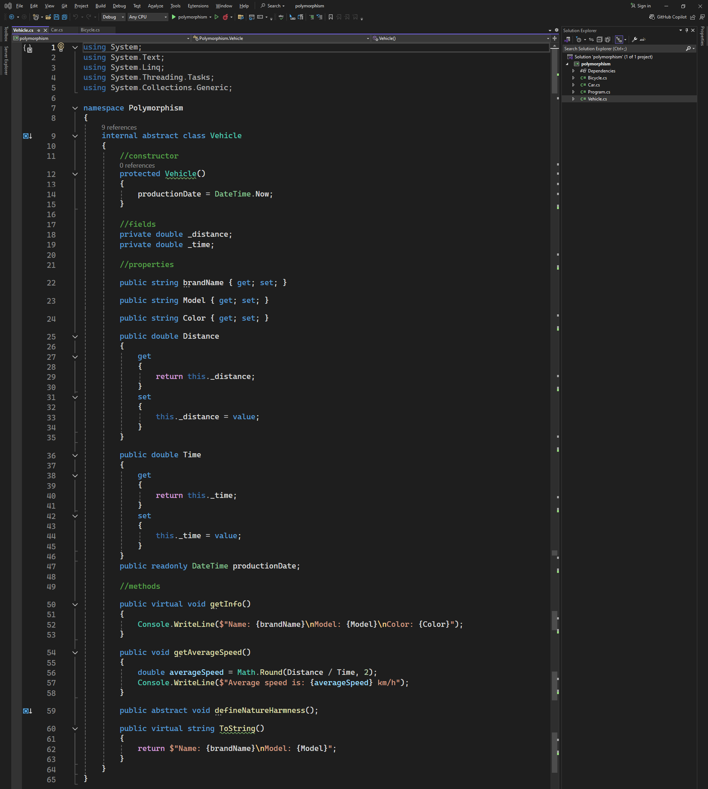
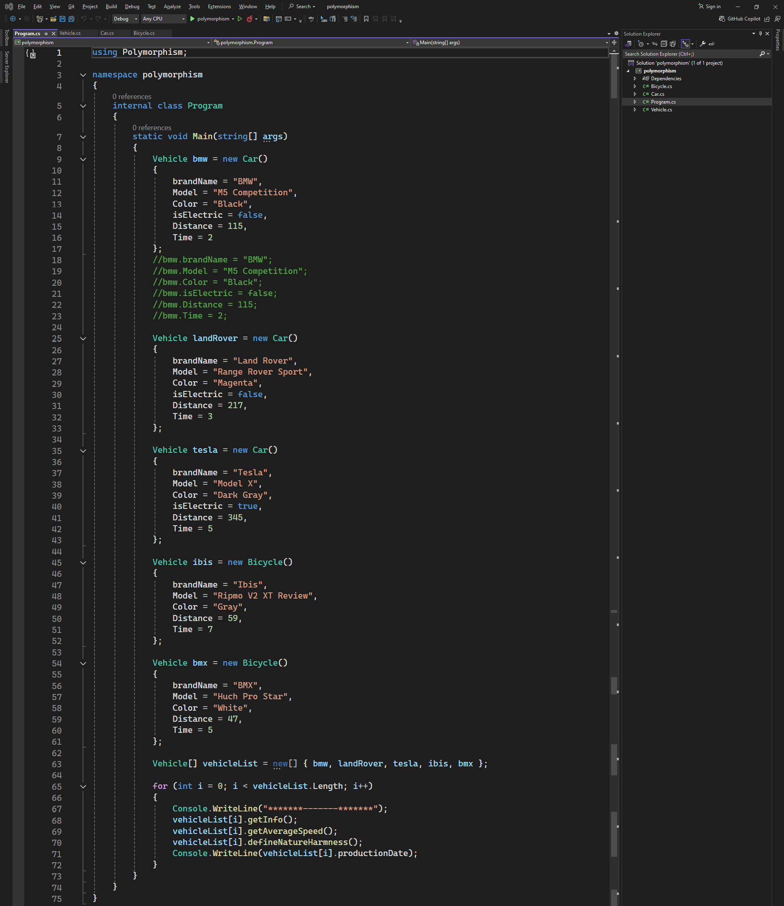

# Polymorphism

### Bicycle code:
```csharp
using System;
using System.Text;
using System.Linq;
using System.Threading.Tasks;
using System.Collections.Generic;

namespace Polymorphism
{
    internal class Bicycle : Vehicle
    {
        //properties
        public string Type { get; set; }

        //methods
        public override void defineNatureHarmness()
        {
            Console.WriteLine($"Nature harmness is none");
        }
    }
}
```
### Bicycle image: 

-------
### Car code:
```csharp
using System;
using System.Text;
using System.Linq;
using System.Threading.Tasks;
using System.Collections.Generic;

namespace Polymorphism
{
    internal class Car : Vehicle
    {
        //fields
        private bool _isElectric;

        //properties
        public byte doorCount { get; set; }
        public bool isElectric
        {
            get
            {
                return _isElectric;
            }
            set
            {
                _isElectric = value;
            }
        }

        //methods
        public override void defineNatureHarmness()
        {
            if (isElectric)
            {
                Console.WriteLine($"Nature harmness is low");
            }
            else
            {
                Console.WriteLine($"Nature harmness is high");
            }
        }
    }
}
```
### Car image: 

-------
### Vehicle code:
```csharp
using System;
using System.Text;
using System.Linq;
using System.Threading.Tasks;
using System.Collections.Generic;

namespace Polymorphism
{
    internal abstract class Vehicle
    {
        //constructor
        protected Vehicle()
        {
            productionDate = DateTime.Now;
        }

        //fields
        private double _distance;
        private double _time;

        //properties
        public string brandName { get; set; }
        public string Model { get; set; }
        public string Color { get; set; }
        public double Distance
        {
            get
            {
                return this._distance;
            }
            set
            {
                this._distance = value;
            }
        }
        public double Time
        {
            get
            {
                return this._time;
            }
            set
            {
                this._time = value;
            }
        }
        public readonly DateTime productionDate;

        //methods
        public virtual void getInfo()
        {
            Console.WriteLine($"Name: {brandName}\nModel: {Model}\nColor: {Color}");
        }
        public void getAverageSpeed()
        {
            double averageSpeed = Math.Round(Distance / Time, 2);
            Console.WriteLine($"Average speed is: {averageSpeed} km/h");
        }
        public abstract void defineNatureHarmness();
        public virtual string ToString()
        {
            return $"Name: {brandName}\nModel: {Model}";
        }
    }
}
```
### Vehicle image: 

-------
### Program code:
```csharp
using Polymorphism;

namespace polymorphism
{
    internal class Program
    {
        static void Main(string[] args)
        {
            Vehicle bmw = new Car()
            {
                brandName = "BMW",
                Model = "M5 Competition",
                Color = "Black",
                isElectric = false,
                Distance = 115,
                Time = 2
            };
            //bmw.brandName = "BMW";
            //bmw.Model = "M5 Competition";
            //bmw.Color = "Black";
            //bmw.isElectric = false;
            //bmw.Distance = 115;
            //bmw.Time = 2;

            Vehicle landRover = new Car()
            {
                brandName = "Land Rover",
                Model = "Range Rover Sport",
                Color = "Magenta",
                isElectric = false,
                Distance = 217,
                Time = 3
            };

            Vehicle tesla = new Car()
            {
                brandName = "Tesla",
                Model = "Model X",
                Color = "Dark Gray",
                isElectric = true,
                Distance = 345,
                Time = 5
            };

            Vehicle ibis = new Bicycle()
            {
                brandName = "Ibis",
                Model = "Ripmo V2 XT Review",
                Color = "Gray",
                Distance = 59,
                Time = 7
            };

            Vehicle bmx = new Bicycle()
            {
                brandName = "BMX",
                Model = "Huch Pro Star",
                Color = "White",
                Distance = 47,
                Time = 5
            };

            Vehicle[] vehicleList = new[] { bmw, landRover, tesla, ibis, bmx };

            for (int i = 0; i < vehicleList.Length; i++)
            {
                Console.WriteLine("*******-------*******");
                vehicleList[i].getInfo();
                vehicleList[i].getAverageSpeed();
                vehicleList[i].defineNatureHarmness();
                Console.WriteLine(vehicleList[i].productionDate);
            }
        }
    }
}
```
### Program image: 

-------
### Output  image:
