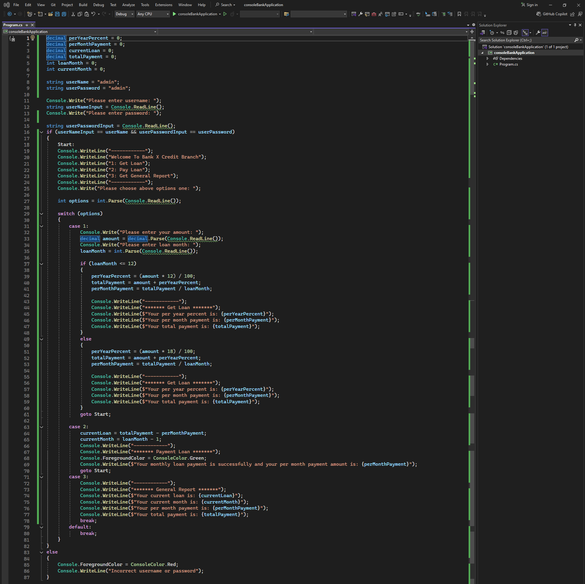

# Simple Console Bank Application

### Task code:
```csharp
decimal perYearPercent = 0;
decimal perMonthPayment = 0;
decimal currentLoan = 0;
decimal totalPayment = 0;
int loanMonth = 0;
int currentMonth = 0;

string userName = "admin";
string userPassword = "admin";

Console.Write("Please enter username: ");
string userNameInput = Console.ReadLine();
Console.Write("Please enter password: ");

string userPasswordInput = Console.ReadLine();
if (userNameInput == userName && userPasswordInput == userPassword)
{
    Start:
    Console.WriteLine("------------");
    Console.WriteLine("Welcome To Bank X Credit Branch");
    Console.WriteLine("1: Get Loan");
    Console.WriteLine("2: Pay Loan");
    Console.WriteLine("3: Get General Report");
    Console.WriteLine("------------");
    Console.Write("Please choose above options one: ");

    int options = int.Parse(Console.ReadLine());
    
    switch (options)
    {
        case 1:
            Console.Write("Please enter your amount: ");
            decimal amount = decimal.Parse(Console.ReadLine());
            Console.Write("Please enter loan month: ");
            loanMonth = int.Parse(Console.ReadLine());

            if (loanMonth <= 12)
            {
                perYearPercent = (amount * 12) / 100;
                totalPayment = amount + perYearPercent;
                perMonthPayment = totalPayment / loanMonth;

                Console.WriteLine("------------");
                Console.WriteLine("******* Get Loan *******");
                Console.WriteLine($"Your per year percent is: {perYearPercent}");
                Console.WriteLine($"Your per month payment is: {perMonthPayment}");
                Console.WriteLine($"Your total payment is: {totalPayment}");
            }
            else
            {
                perYearPercent = (amount * 18) / 100;
                totalPayment = amount + perYearPercent;
                perMonthPayment = totalPayment / loanMonth;

                Console.WriteLine("------------");
                Console.WriteLine("******* Get Loan *******");
                Console.WriteLine($"Your per year percent is: {perYearPercent}");
                Console.WriteLine($"Your per month payment is: {perMonthPayment}");
                Console.WriteLine($"Your total payment is: {totalPayment}");
            }
            goto Start;

        case 2:
            currentLoan = totalPayment - perMonthPayment;
            currentMonth = loanMonth - 1;
            Console.WriteLine("------------");
            Console.WriteLine("******* Payment Loan *******");
            Console.ForegroundColor = ConsoleColor.Green;
            Console.WriteLine($"Your monthly loan payment is successfully and your per month payment amount is: {perMonthPayment}");
            goto Start;
        case 3:
            Console.WriteLine("------------");
            Console.WriteLine("******* General Report *******");
            Console.WriteLine($"Your current loan is: {currentLoan}");
            Console.WriteLine($"Your current month is: {currentMonth}");
            Console.WriteLine($"Your per month payment is: {perMonthPayment}");
            Console.WriteLine($"Your total payment is: {totalPayment}");
            break;
        default:
            break;
    }
}
else
{
    Console.ForegroundColor = ConsoleColor.Red;
    Console.WriteLine("Incorrect username or password");
}
```
### Task image:
