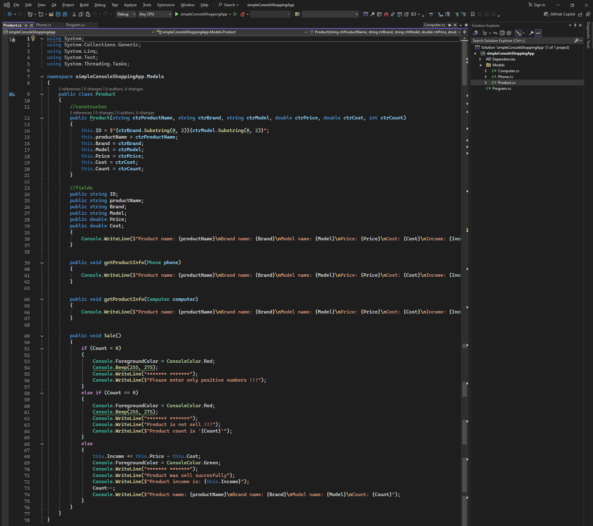
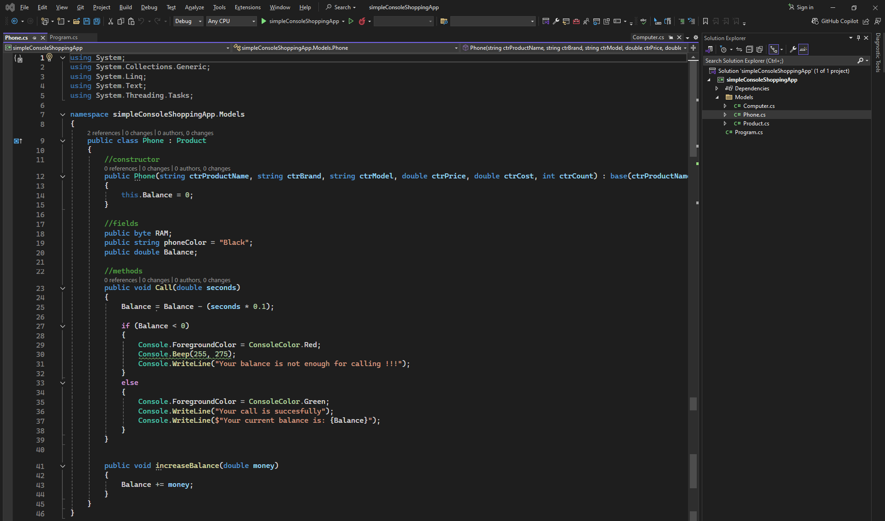
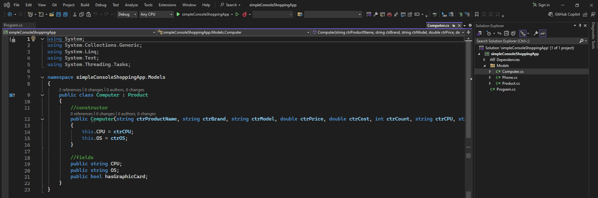

# Simple Console Shopping App

### Product class code:
```csharp
using System;
using System.Collections.Generic;
using System.Linq;
using System.Text;
using System.Threading.Tasks;

namespace simpleConsoleShoppingApp.Models
{
    public class Product
    {
        //constructor
        public Product(string ctrProductName, string ctrBrand, string ctrModel, double ctrPrice, double ctrCost, int ctrCount)
        {
            this.ID = $"{ctrBrand.Substring(0, 2)}{ctrModel.Substring(0, 2)}";
            this.productName = ctrProductName;
            this.Brand = ctrBrand;
            this.Model = ctrModel;
            this.Price = ctrPrice;
            this.Cost = ctrCost;
            this.Count = ctrCount;
        }

        //fields
        public string ID;
        public string productName;
        public string Brand;
        public string Model;
        public double Price;
        public double Cost;
        public double Income;
        public int Count;

        //methods
        public void getProductInfo()
        {
            Console.WriteLine($"Product name: {productName}\nBrand name: {Brand}\nModel name: {Model}\nPrice: {Price}\nCost: {Cost}\nIncome: {Income}\nCount: {Count}");
        }

        public void getProductInfo(Phone phone)
        {
            Console.WriteLine($"Product name: {productName}\nBrand name: {Brand}\nModel name: {Model}\nPrice: {Price}\nCost: {Cost}\nIncome: {Income}\nCount: {Count}\nPhone Color: {phone.phoneColor}");
        }

        public void getProductInfo(Computer computer)
        {
            Console.WriteLine($"Product name: {productName}\nBrand name: {Brand}\nModel name: {Model}\nPrice: {Price}\nCost: {Cost}\nIncome: {Income}\nCount: {Count}\nCPU: {computer.CPU}\nOS: {computer.OS}");
        }

        public void Sale()
        {
            if (Count < 0)
            {
                Console.ForegroundColor = ConsoleColor.Red;
                Console.Beep(255, 275);
                Console.WriteLine("******* *******");
                Console.WriteLine($"Please enter only positive numbers !!!");
            }
            else if (Count == 0)
            {
                Console.ForegroundColor = ConsoleColor.Red;
                Console.Beep(255, 275);
                Console.WriteLine("******* *******");
                Console.WriteLine("Product is not sell !!!");
                Console.WriteLine($"Product count is '{Count}'");
            }
            else
            {
                this.Income += this.Price - this.Cost;
                Console.ForegroundColor = ConsoleColor.Green;
                Console.WriteLine("******* *******");
                Console.WriteLine("Product was sell succesfully");
                Console.WriteLine($"Product income is: {this.Income}");
                Count--;
                Console.WriteLine($"Product name: {productName}\nBrand name: {Brand}\nModel name: {Model}\nCount: {Count}");
            }
        }
    }
}
```
### Product class image: 

--- ---
### Phone class code:
```csharp
using System;
using System.Collections.Generic;
using System.Linq;
using System.Text;
using System.Threading.Tasks;

namespace simpleConsoleShoppingApp.Models
{
    public class Phone : Product
    {
        //constructor
        public Phone(string ctrProductName, string ctrBrand, string ctrModel, double ctrPrice, double ctrCost, int ctrCount) : base(ctrProductName, ctrBrand, ctrModel, ctrPrice, ctrCost, ctrCount)
        {
            this.Balance = 0;
        }

        //fields
        public byte RAM;
        public string phoneColor = "Black";
        public double Balance;

        //methods
        public void Call(double seconds)
        {
            Balance = Balance - (seconds * 0.1);

            if (Balance < 0)
            {
                Console.ForegroundColor = ConsoleColor.Red;
                Console.Beep(255, 275);
                Console.WriteLine("Your balance is not enough for calling !!!");
            }
            else
            {
                Console.ForegroundColor = ConsoleColor.Green;
                Console.WriteLine("Your call is succesfully");
                Console.WriteLine($"Your current balance is: {Balance}");
            }
        }

        public void increaseBalance(double money)
        {
            Balance += money;
        }
    }
}
```
### Phone class image:

--- ---
### Computer class code:
```csharp
using System;
using System.Collections.Generic;
using System.Linq;
using System.Text;
using System.Threading.Tasks;

namespace simpleConsoleShoppingApp.Models
{
    public class Computer : Product
    {
        //constructor
        public Computer(string ctrProductName, string ctrBrand, string ctrModel, double ctrPrice, double ctrCost, int ctrCount, string ctrCPU, string ctrOS) : base(ctrProductName, ctrBrand, ctrModel, ctrPrice, ctrCost, ctrCount)
        {
            this.CPU = ctrCPU;
            this.OS = ctrOS;
        }

        //fields
        public string CPU;
        public string OS;
        public bool hasGraphicCard;
    }
}
```
### Computer class image:
