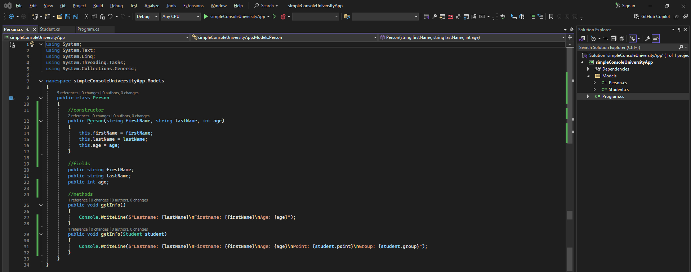
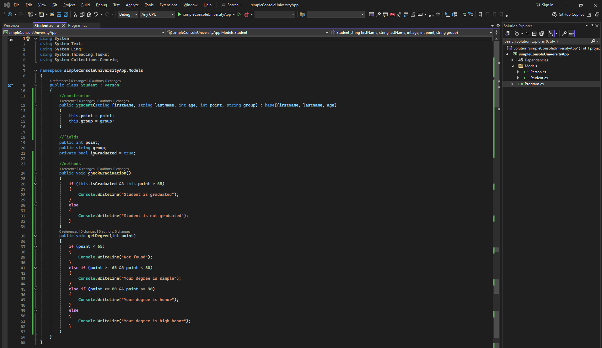

# Simple Console University App

### Person class code:
```csharp
using System;
using System.Text;
using System.Linq;
using System.Threading.Tasks;
using System.Collections.Generic;

namespace simpleConsoleUniversityApp.Models
{
    public class Person
    {
        //constructor
        public Person(string firstName, string lastName, int age)
        {
            this.firstName = firstName;
            this.lastName = lastName;
            this.age = age;
        }

        //fields
        public string firstName;
        public string lastName;
        public int age;

        //methods
        public void getInfo()
        {
            Console.WriteLine($"Lastname: {lastName}\nFirstname: {firstName}\nAge: {age}");
        }
        public void getInfo(Student student)
        {
            Console.WriteLine($"Lastname: {lastName}\nFirstname: {firstName}\nAge: {age}\nPoint: {student.point}\nGroup: {student.group}");
        }
    }
}
```
### Person class image: 

--- ---
### Student class code:
```csharp
using System;
using System.Text;
using System.Linq;
using System.Threading.Tasks;
using System.Collections.Generic;

namespace simpleConsoleUniversityApp.Models
{
    public class Student : Person
    {
        //constructor
        public Student(string firstName, string lastName, int age, int point, string group) : base(firstName, lastName, age)
        {
            this.point = point;
            this.group = group;
        }

        //fields
        public int point;
        public string group;
        private bool isGraduated = true;

        //methods
        public void checkGradiuation()
        {
            if (this.isGraduated && this.point > 65)
            {
                Console.WriteLine("Student is graduated");
            }
            else
            {
                Console.WriteLine("Student is not graduated");
            }
        }
        public void getDegree(int point)
        {
            if (point < 65)
            {
                Console.WriteLine("Not found");
            }
            else if (point >= 65 && point < 80)
            {
                Console.WriteLine("Your degree is simple");
            }
            else if (point >= 80 && point <= 90)
            {
                Console.WriteLine("Your degree is honor");
            }
            else
            {
                Console.WriteLine("Your degree is high honor");
            }
        }
    }
}
```
### Student class image:
