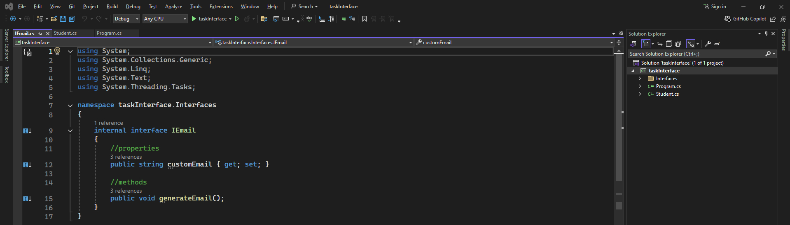
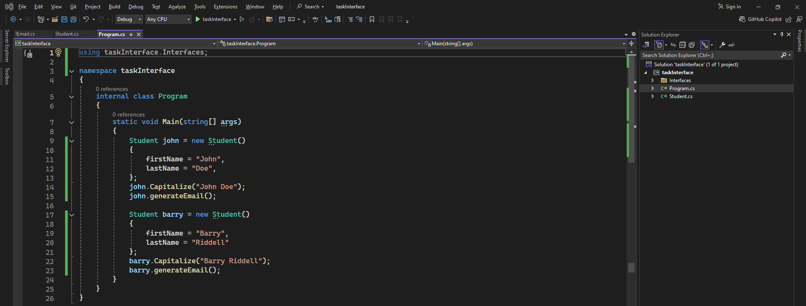
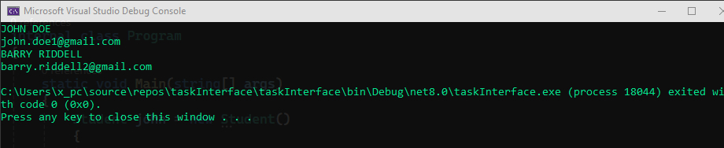

# Interface

### Student code:
```csharp
using System;
using System.Collections.Generic;
using System.Linq;
using System.Text;
using System.Threading.Tasks;
using taskInterface.Interfaces;

namespace taskInterface
{
    internal class Student : IEmail
    {
        //constructor
        public Student()
        {
            Count++;
            ID += Count;
        }

        //properties
        public int ID { get; set; }
        public string firstName { get; set; }
        public string lastName { get; set; }
        public static int Count { get; set; }
        public string customEmail { get; set; }

        //methods
        public void Capitalize(string word)
        {
            Console.WriteLine(word.ToUpper());
        }
        public void generateEmail()
        {
            customEmail = $"{firstName.ToLower()}.{lastName.ToLower()}{ID}@gmail.com";
            Console.WriteLine(customEmail);
        }
    }
}
```
### Student image: 

-------
### IEmail code:
```csharp
using System;
using System.Collections.Generic;
using System.Linq;
using System.Text;
using System.Threading.Tasks;

namespace taskInterface.Interfaces
{
    internal interface IEmail
    {
        //properties
        public string customEmail { get; set; }

        //methods
        public void generateEmail();
    }
}
```
### IEmail image: 

-------
### Program code:
```csharp
using taskInterface.Interfaces;

namespace taskInterface
{
    internal class Program
    {
        static void Main(string[] args)
        {
            Student john = new Student()
            {
                firstName = "John",
                lastName = "Doe",
            };
            john.Capitalize("John Doe");
            john.generateEmail();

            Student barry = new Student()
            {
                firstName = "Barry",
                lastName = "Riddell"
            };
            barry.Capitalize("Barry Riddell");
            barry.generateEmail();
        }
    }
}
```
### Program image: 

-------
### Output  image:
