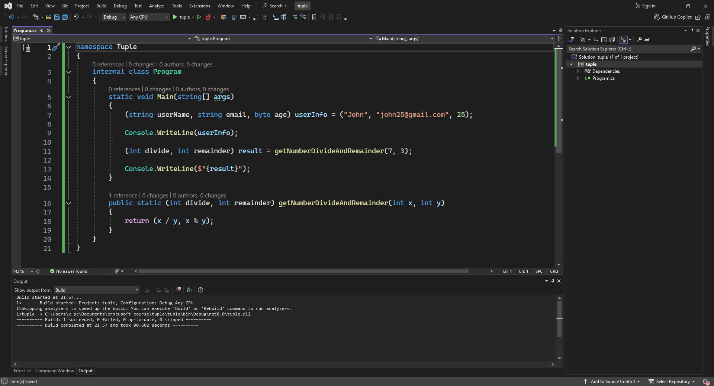

# Tuple

### Program code:
```csharp
namespace Tuple
{
    internal class Program
    {
        static void Main(string[] args)
        {
            (string userName, string email, byte age) userInfo = ("John", "john25@gmail.com", 25);

            Console.WriteLine(userInfo);

            (int divide, int remainder) result = getNumberDivideAndRemainder(7, 3);

            Console.WriteLine($"{result}");
        }

        public static (int divide, int remainder) getNumberDivideAndRemainder(int x, int y)
        {
            return (x / y, x % y);
        }
    }
}
```
### Program image: 
